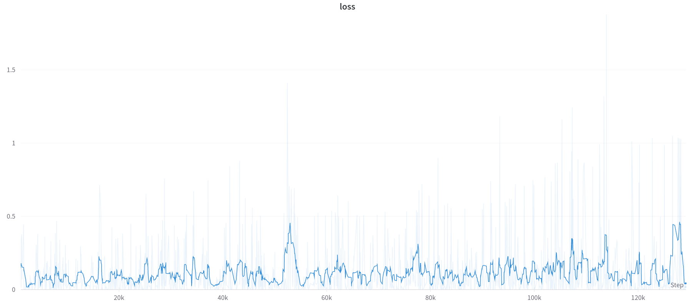

# 딥 강화학습 기말 프로젝트

# 스마트항공모빌리티학과

## 2020418001 정재환

---

# 목차

1. Q-Learning
2. DQN
3. Network
4. Image Input
5. Training
6. Wandb & Result

---

# 1. Q-learning

벨만 방정식을 기반으로 하는 off-policy Model 알고리즘 중 하나이다.

Q-learning 수식은 아래와 같다.

$$
q_{t+1}(s,a) = q_t(s_t,a_t)+\alpha_t (R_{t+1}+\gamma \mathrm{max}q_t(s_{t+1},a')-q_t(S_t,A_t))
$$

$\alpha$ 는 학습률을 나타내고 $\gamma$ 는 discount factor이다.

위 수식을 $\epsilon-greedy$ 정책을 활용하여 q값을 찾아야 한다.

정리하면 아래와 같다.

1. 현재의 특정 상태 $s_t$  에 존재한다.
2. 이때 agent가 할수있는 모든 Action을 수행한다.
3. Action 수행 결과 가장 큰 $\mathrm{max}q_t(s_{t+1},a')$ 를 구한 후 $q_{t+1}(s,a)$를 업데이트를 한다

---

# 2. DQN

강화학습과 딥러닝의 접목으로 고차원의 State 정보도 해석이 가능하게 됨

- 기존의 Q-learning으로 수행할 경우 84x84의 이미지의 정보를 가지고 Q-table을 구성하게되면 매우 큰 table이 필요하므로 수행이 매우 어려움.

Atari의 화면을 관찰하여 Action을 선택, 게임 점수를 최대화 시키는것이 목적이다.

DQN 알고리즘의 Overview는 아래와 같다.


게임 이미지를 state로 입력으로 받고 네트워크를 지난 뒤 현재 state에서 어떤 action을 해야할지 
선택한다.

## a. 상관성

Model-free 의경우 자신의 경험으로만 최적의 정책을 찾아야한다. Model-free는 환경 전체를 

observed 할 수 없기때문에 제대로된 학습이 불가능하다.

따라서 DQN에서는 이러한 문제를 해결하기 위해서 Replay memory를 구성하였다.

Replay Memory에는 이전의 경험을 저장하고 학습할 때 일부를 꺼내서 학습에 사용하게 된다.

이럴경우 state간의 상관성이 줄어들기 때문에 보다 정확한 학습이 가능하다.

이번 프로젝트에서 활용한 방법은 아래와 같다.

1. 특정 State에서 특정 Action을 수행한다.
2. 이때의 reward와 state, Action을 Replay memory에 저장한다.
3. Policy net을 학습할때 일정확률로 Replay Memory의 값을 사용하여 학습한다.

이럴경우 현재 State와 이전의 State로만 학습을 할 경우에는 큰 상관관계가 존재하지만

현재 State와 바로 직전 State가 아닌 이전 episode에서 획득한 Replay memory를 사용할 경우 

상관관계를 상당히 줄일수 있어 보다 좋은 학습을 수행할 수 있다.

## b. Network 불안정성

1번의 episode를 진행하고나서 network를 업데이트를 수행한다.

업데이트를 수행할 때 loss를 계산할 경우 자기 자신을 목표로써 loss를 계산 후 업데이트를 수행한다.

이렇게 될 경우 업데이트마다 목표가 계속해서 변화하게 되며 이로인해 Q값을 계산할때 목표에 따라서 계속해서 변화하기 때문에 불안정해진다.

따라서 이러한 문제를 해결하기 위해서

매번 업데이트를 수행하는것이 아닌 Target net과 Policy net을 분리하고 Target net을 일정 기간마다 Policy net으로 복사해서 학습을 수행하게 되면 보다 안정적인 Q값을 얻을 수 있다.

## c. Convolutional Neural Network 적용

GYM에서는 현재 State에 대한 정보를 제공한다 예를들어 cartpole의 경우

카트의 위치, 카트의 속도, 막대 각도, 막대 속도 총 4가지의 State를 제공한다.

하지만 이것은 Model-base의 상황과 크게 다를 바 없다. 본 프로젝트에서는

Model-free로써 Atari game의 화면을 입력으로 강화학습을 시키는것이 목적이다.

---

# 3. Network

이번 프로젝트에서는 4장의 흑백컬러의 84x84사이즈의 이미지를 State로 지정하였다.


이와 같은 이미지를 학습하는 Network를 아래와 같이 구성하였다.

```python
        self.conv1 = nn.Conv2d(4, 16, kernel_size=8, stride=2)
        self.bn1 = nn.BatchNorm2d(16)
        self.conv2 = nn.Conv2d(16, 32, kernel_size=4, stride=2)
        self.bn2 = nn.BatchNorm2d(32)
        self.conv3 = nn.Conv2d(32, 32, kernel_size=5, stride=2)
        self.bn3 = nn.BatchNorm2d(32)
```

위와 같은 Network를 각각 Policy net과 Target net으로 구성하였다.

최적화를 위한 방법으로는 RMSProp을 사용하였다. 

Loss의 경우 가장 일반적인 L1 Loss를 사용하였다.

---

# 4. Input Image Processing

3장에서 State의 입력은 84x84 크기의 이미지를 4장을 사용하는 형태로 진행하였다.

1. 우선 GYM의 이미지를 획득하여야 한다. 
아래 이미지는 3x210x160의 크기를 가지고 있다.
    
    
    
2. 일단 컬러를 흑백으로 변환시켜서 210x160으로 변환한다.
3. 흑백이미지를 보다 명확하게 하기 위해서 각 pixel 데이터가 0 이상인것은 모두 255로 변경한다.
4. 위 그림에서 우리가 관심있는 부분은 점수와 벽면을 제외한 부분
즉 벽돌과 움직이는 판이다.
이부분만 잘라내서 크기를 축소시킨다.
5. 축소된 이미지를 위 3장에 나온것과 같이 84x84사이즈로 변환한다.
6. 4.에서 획득한 흑백 이미지는 다르게 표현하면 1x84x84가 된다. 
7. 우리는 총 4개의 이미지를 사용하기로 하였다 따라서 흑백이지만 컬러 이미지처럼 
4개의 채널로 구성하여 최종적으로 4x84x84로 조작하여 Input Image State로 변환할 수 있다.


---

# 5. Training

우선 Training에 사용된 Hyper-parameter는 아래와 같다

```python
hyperparameter_defaults = dict(
    batch_size = 100,
    eps_end = 0.1,
    eps_explore = 100000,
    learning_rate = 0.01,
    replay = 10000,
    )
```

1. 최초 실행시 State는 초기 화면을 사용한다.
이때 Input state는 4장의 이미지를 사용해야 하나 아직 4번의 스탭이 진행되지 않았기 때문에
동일한 이미지를 4장 사용하여 Input state를 만들었다.
2. Action을 선택하는 방법으로 우리는 $\epsilon-greedy$ 를 사용하기로 하였다.
따라서 아래와 같이 epsilon 정의 하였다

```python
if eps_threshold > EPS_END:
            eps_threshold -= (EPS_START - EPS_END) / EPS_EXPLORE
```

1. 계산된 eps_threshold와 Random으로 발생시킨 숫자를 비교하여 최종 Action을 선택한다.
만약 random ≤ eps_threshold가 참일 경우 Gym에서 실행가능한 Action중 1개를 랜덤으로 선택하여 수행하고 거짓일 경우 Policy net에서 획득한 Action을 수행한다.
2. 선택된 Action을 Agent에 명령으로 입력 후 획득되는 State들을 Replay Memory에 저장한다.
이때 State는 여전히 Image이다. 따라서 4개의 Stack 이미지에서 첫번째 이미지는 버린 후
새로운 State를 넣어 다시 4개의 Stack Image를 만들어준다.
3. Replay Memory에 저장된 데이터를 바탕으로 Policy net 학습을 수행한다.
이때 Greadient는 RMSProp을 사용하였다.
4. Policy net을 10회 학습할 때 마다 Target net에  Policy net을 복사하여 Target을 변경한다.

---

# 6. Wandb & Result

Hyper-parameter와 학습상황을 모니터링 하기 위해서 Wandb를 사용하였다.

우선 Hyper-parameter를 획득하기 위한 목록은 아래와 같다

```python
hyperparameter_defaults = dict(
    batch_size = 100,
    eps_end = 0.1,
    eps_explore = 100000,
    learning_rate = 0.01,
    replay = 10000,
    )
```

Wandb의 Sweep를 활용하여 Hyper-parameter를 획득하였고 configuration은 아래와 같다.


500 episode를 학습하는 방식으로 parameter를 구하였다.

전체적인 Parameter는 아래 그림과 같이 나타났다.


가장 우측이 평균점수로 가장 높은 점수는 1.44점으로 나타나며

파라미터는 각각 아래와 같다.

```python
    batch_size = 19,
    eps_end = 0.3496,
    eps_explore = 3656191,
    learning_rate = 0.7032,
    replay = 95559,
```

해당 파라미터로 학습할 때의 Loss는 아래와 같다.



Loss를 Wandb에서 제공하는 Running Average를 10으로 설정하였을때 대략 0.2로 나타난다.

학습을 지속적으로 수행하지만 Score가 개선되는 것은 확인할 수 없었다.

## 결론 고찰

1. DQN으로 학습을 수행하였으나 성능이 개선되는 것을 확인할 수 없었다.
2. 학습이 제대로 안된 이유로 추정되는것은 다음과 같다.
    1. 너무 과도한 epsilon 값으로 인한 Random Action의 과도한 실행
    2. a.의 이유가 타당할 경우 많은 Training 횟수로 극복이 가능
    (코드에서 epsilon은 episode가 지날때마다 감소하므로 Policy net에서 획득한
    Action을 선택할 확률이 높아지며 Policy net이 학습이 잘 되었다면 높은 점수를 내었을것으로 예상)
    3. 잘못된 Code 작성 및 알고리즘 구현
3. 차후 계획
    1. 2. 의 실패원인의 해결을 통한 DQN 구현 완료
    2. Gym에서 획득되는 State (Ex. Cartpole 속도, 막대 각도 등)일부와 Image를 동시에 
    Input으로 줄 경우의 성능 판단.
    3. b.에서 얻은 결과를 바탕으로 Multicopter의 하방 Image와 Dynamics Observer의
    결합을 통한 Moter & AHRS Fault Detection 연구

### 1. Breakout based Hyper-parameter Optimization Sweep Report

[https://wandb.ai/jeawhan/RL_1/reports/2022_RL_JeawhanChung--VmlldzoyMjI2MzI0](https://wandb.ai/jeawhan/RL_1/reports/2022_RL_JeawhanChung--VmlldzoyMjI2MzI0)
https://wandb.ai/jeawhan/RL_1/reports/2022_RL_JeawhanChung--VmlldzoyMjI2MzI0?accessToken=y8ygfbn1xip9p8yszi24wsjht5zcgwqpgsftosjntb55uizuur5nza5eg35jg3dm

## 2. Breakout Result

1. Average score


b. Loss


c. Wandb

[https://wandb.ai/jeawhan/RL_1/reports/Breakout-Result--VmlldzoyMjI2NTE2](https://wandb.ai/jeawhan/RL_1/reports/Breakout-Result--VmlldzoyMjI2NTE2)
https://wandb.ai/jeawhan/RL_1/reports/Breakout-Result--VmlldzoyMjI2NTE2?accessToken=3s2e6stx338noreq1hzhy8ewbt9gh2m5pze6o79cb9dq5cfwhmzjwb10vnbro1t2

## 3.  Pong Result

1. Average score


b. Loss


c. Wandb

[https://wandb.ai/jeawhan/RL_1/reports/Pong-Result--VmlldzoyMjI2NTE4](https://wandb.ai/jeawhan/RL_1/reports/Pong-Result--VmlldzoyMjI2NTE4)
https://wandb.ai/jeawhan/RL_1/reports/Pong-Result--VmlldzoyMjI2NTE4?accessToken=bz3g8obyfcno2ncvf95dh4wukl0b1ipfekqxbd5zkwzgec2ajo7613ecr3jfmh0d

## 4. Qbert Result

1. Average score


b. Loss


c. Wandb

[https://wandb.ai/jeawhan/RL_1/reports/Qbert-Result--VmlldzoyMjI2NTIw](https://wandb.ai/jeawhan/RL_1/reports/Qbert-Result--VmlldzoyMjI2NTIw)
https://wandb.ai/jeawhan/RL_1/reports/Qbert-Result--VmlldzoyMjI2NTIw?accessToken=nwprigrwv8c07hqvtblrwky3ivtv7icw1atm720ilbual7hfxzz7s8ntvvzpy438

## 5. SpaceInvaders Result

1. Average score


b. Loss


c. wandb

[https://wandb.ai/jeawhan/RL_1/reports/SpaceInvaders-Result--VmlldzoyMjI2NTIx](https://wandb.ai/jeawhan/RL_1/reports/SpaceInvaders-Result--VmlldzoyMjI2NTIx)
https://wandb.ai/jeawhan/RL_1/reports/SpaceInvaders-Result--VmlldzoyMjI2NTIx?accessToken=iurdzibj0uoaosw8rplvr337az8xn7m7lknb5jkoeihaz1d6tnmalev1x80kbbrb

## 6. Assault Result

1. Average score


b. Loss 


c. wandb

[https://wandb.ai/jeawhan/RL_1/reports/Assault-Result--VmlldzoyMjI2NTQ0](https://wandb.ai/jeawhan/RL_1/reports/Assault-Result--VmlldzoyMjI2NTQ0)
https://wandb.ai/jeawhan/RL_1/reports/Assault-Result--VmlldzoyMjI2NTQ0?accessToken=jvfrb7y9rqjtb6cokj96gh33s5tug8334mfzbnocdr2fmhxju0biwz1uxi1goxw0
